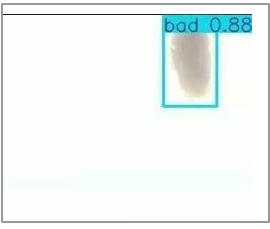

# AUTO-COCOON: Vision-Integrated System for Cocoon Processing and Quality Characterisation

AUTO-COCOON is an AI-powered computer vision system for automated silk cocoon quality assessment and sorting. The project integrates image enhancement using a Convolutional Autoencoder (CAE), YOLOv8-based object detection, and a real-time inference pipeline to classify silk cocoons as **Good** or **Bad**. The system aims to reduce manual inspection, improve classification consistency, and support scalable cocoon processing for sericulture applications.

---

# 📌 Project Overview

<table>
<tr>
<td align="center"><b>System Architecture</b></td>
<td align="center"><b>Experimental Setup</b></td>
</tr>

<tr>
<td></td>
<td></td>
</tr>

<tr>
<td align="center"><b>CAE Augmentation</b></td>
<td align="center"><b>Model Development Pipeline</b></td>
</tr>

<tr>
<td></td>
<td></td>
</tr>

</table>

---

# 🚀 Project Highlights

- Automated Cocoon Quality Assessment using Computer Vision
- YOLOv8-based Object Detection and Classification
- Convolutional Autoencoder (CAE) for Image Augmentation
- Real-Time Inference Pipeline
- Modular AI System Design
- Scalable Architecture for Automated Cocoon Sorting

---

# 📖 Overview

Silk cocoon quality assessment is traditionally performed through manual inspection, which is labor-intensive and prone to inconsistencies. AUTO-COCOON addresses this challenge by integrating computer vision and deep learning techniques into an automated inspection workflow.

A Convolutional Autoencoder (CAE) is used to generate high-quality augmented images, improving dataset diversity and model generalization. The enhanced dataset is then used to train a YOLOv8 model capable of detecting and classifying cocoon quality. The trained model is integrated into a real-time inference pipeline for automated cocoon inspection.

---

# 🏗 System Architecture

The system consists of a loader module, deflosser module, conveyor mechanism, image acquisition unit, YOLOv8-based quality assessment, and a sorting mechanism for separating good and bad cocoons.

<p align="center">

</p>

---

# 🧠 Model Development Pipeline

The AI model was developed using the following workflow.

<p align="center">

</p>

---

# 🔬 Experimental Setup

The prototype integrates hardware and software components required for automated cocoon inspection.

### Hardware Components

- Loader Module
- Deflosser Module
- Conveyor Module
- Camera Module
- LED Illumination
- AI Processing Unit
- Sorting Mechanism

<p align="center">

</p>

---

# 📂 Dataset

The dataset consists of cocoon images captured under controlled lighting conditions. Images were annotated into **Good** and **Bad** quality classes before training.

<p align="center">

</p>

---

# 🖼 Image Enhancement using Convolutional Autoencoder (CAE)

To improve dataset diversity while preserving important cocoon characteristics, a Convolutional Autoencoder (CAE) was employed to generate augmented training samples.

### Original vs CAE-Augmented Images

<p align="center">

</p>

---

# 🎯 YOLOv8 Detection Results

The trained YOLOv8 model performs real-time cocoon detection and quality classification.

### Good Cocoon Detection

<p align="center">

</p>

### Bad Cocoon Detection

<p align="center">

</p>

---

# 📊 Performance Metrics

The model achieved strong performance for cocoon quality classification.

<p align="center">

</p>

---

# ⚙ Project Workflow

1. Capture cocoon images
2. Annotate the dataset
3. Perform image preprocessing
4. Generate augmented images using CAE
5. Train the YOLOv8 model
6. Evaluate model performance
7. Deploy the trained model
8. Perform real-time cocoon detection
9. Classify cocoon quality as Good or Bad
10. Send output to the sorting mechanism

---

# 🛠 Technologies Used

- Python
- OpenCV
- Ultralytics YOLOv8
- TensorFlow / Keras
- NumPy
- Intel RealSense / External Camera
- Google Colab

---

# 📁 Repository Structure

```text
AUTO-COCOON
│
├── images/
│   ├── system_architecture.png
│   ├── model_development_pipeline.png
│   ├── setup.jpeg
│   ├── raw_captured_img.png
│   ├── cae_before_after.png
│   ├── yolo_detection_good.png
│   ├── yolo_detection_bad.png
│   └── performance_metric.png
│
├── cae_augmentation/
├── yolo_training/
├── integration/
├── requirements.txt
├── LICENSE
└── README.md
```

---

# 🌱 Future Enhancements

- Conveyor-based automated sorting
- Servo motor integration
- Edge deployment using Jetson Nano
- Raspberry Pi implementation
- Multi-grade cocoon quality assessment
- Cloud-based monitoring dashboard

---

# 💻 Installation

```bash
git clone https://github.com/vibha92005/AUTO-COCOON-Vision-integrated-system-for-cocoon-processing-and-quality-characterisation.git

cd AUTO-COCOON-Vision-integrated-system-for-cocoon-processing-and-quality-characterisation

pip install -r requirements.txt
```

---

# 👩‍💻 Contributors

- **Vibha I S**
- **Ashitha M**

Department of Electronics and Communication Engineering

---

# 📄 License

This project is licensed under the MIT License.
