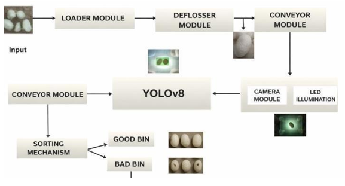
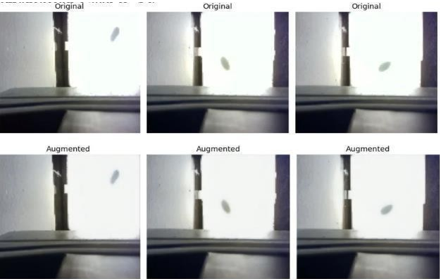
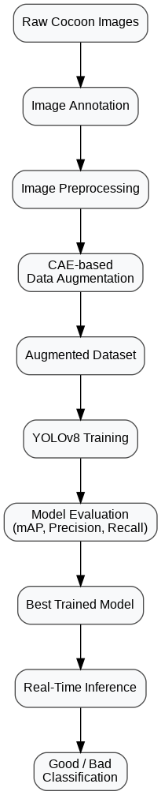

# AUTO-COCOON: Vision-Integrated System for Cocoon Processing and Quality Characterisation

AUTO-COCOON is an AI-powered computer vision system for automated silk cocoon quality assessment and sorting. The project combines image enhancement using a Convolutional Autoencoder (CAE), deep learning-based object detection with YOLOv8, and a real-time inference pipeline to classify silk cocoons as **Good** or **Bad**. The system is designed to reduce manual inspection, improve classification consistency, and support scalable cocoon processing for sericulture applications.

---

# 📌 Project Overview

<table>
<tr>
<td align="center"><b>System Architecture</b></td>
<td align="center"><b>Prototype Setup</b></td>
</tr>

<tr>
<td></td>
<td></td>
</tr>

<tr>
<td align="center"><b>CAE Augmentation</b></td>
<td align="center"><b>YOLOv8 Detection</b></td>
</tr>

<tr>
<td></td>
<td></td>
</tr>

</table>

---

# 🚀 Project Highlights

- AI-powered Cocoon Quality Assessment
- YOLOv8-based Object Detection and Classification
- CAE-based Dataset Augmentation
- Real-Time Inference Pipeline
- Modular Project Architecture
- Designed for Automated Cocoon Sorting

---

# 📖 Overview

Traditional cocoon quality inspection relies on manual observation, making it time-consuming and prone to inconsistencies. AUTO-COCOON addresses this challenge by integrating computer vision and deep learning techniques into an automated inspection workflow.

The project uses a Convolutional Autoencoder (CAE) to generate high-quality augmented images, improving dataset diversity and model generalization. The enhanced dataset is then used to train a YOLOv8 model capable of detecting and classifying cocoon quality. The trained model is integrated into a real-time inference pipeline, making the system suitable for future deployment in automated cocoon sorting environments.

---

# 🏗 System Architecture

The complete system consists of hardware modules for cocoon transportation, image acquisition, AI-based quality assessment, and automated sorting.

> **Replace with your system architecture diagram**

<p align="center">

</p>

---

# 🧠 Model Development Pipeline

The AI model was developed using the following workflow.

> **Replace with your model development pipeline**

<p align="center">

</p>

---

# 🔬 Experimental Setup

The experimental prototype integrates hardware and software components required for automated cocoon inspection.

### Hardware Components

- Loader Module
- Deflosser Module
- Conveyor Module
- Camera Module
- LED Illumination Unit
- AI Processing Unit
- Sorting Mechanism

> **Replace with setup image**

<p align="center">

</p>

---

# 📂 Dataset

The dataset consists of silk cocoon images captured under controlled lighting conditions using a vision acquisition setup. Images were manually annotated and categorized into **Good** and **Bad** quality cocoons for model training and evaluation.

> **Replace with dataset sample**

<p align="center">

</p>

---

# 🖼 Image Enhancement using CAE

To improve dataset diversity while preserving structural characteristics of the cocoons, a Convolutional Autoencoder (CAE) was used for image augmentation.

### Original vs CAE-Augmented Images

> **Replace with before vs after augmentation image**

<p align="center">

</p>

---

# 🎯 YOLOv8 Detection Results

The augmented dataset was used to train a YOLOv8 object detection model capable of identifying and classifying cocoon quality in real time.

> **Replace with YOLO detection results**

<p align="center">

</p>

---

# ⚙ Real-Time Inference Workflow

The deployed system follows the workflow below:

1. Monitor incoming cocoon images
2. Load the captured image
3. Perform image preprocessing
4. Run inference using the trained YOLOv8 model
5. Detect cocoon objects
6. Classify cocoons as **Good** or **Bad**
7. Display prediction
8. Send output for automated sorting

> *(Optional: Insert your inference flowchart here.)*

<p align="center">

</p>

---

# 🛠 Technologies Used

- Python
- OpenCV
- Ultralytics YOLOv8
- TensorFlow / Keras
- NumPy
- Intel RealSense / External Camera
- Google Colab

---

# 📁 Repository Structure

```text
AUTO-COCOON
│
├── images/
│   ├── system_architecture.png
│   ├── model_development_pipeline.png
│   ├── setup.png
│   ├── raw_dataset.png
│   ├── cae_before_after.png
│   ├── yolo_detection.png
│   └── inference_workflow.png
│
├── cae_augmentation/
│   ├── cae_augmentation.py
│   └── README.md
│
├── yolo_training/
│   ├── train.py
│   └── README.md
│
├── integration/
│   ├── integration.py
│   └── README.md
│
├── requirements.txt
├── LICENSE
└── README.md
```

---

# 📊 Results

| Metric | Value |
|---------|--------|
| Precision | 91.7% |
| Recall | 97.4% |
| mAP@50 | 95.8% |
| SSIM (CAE) | 0.99 |

> Replace these values with your final experimental results if they differ.

---

# 🌱 Future Enhancements

- Conveyor-based automated sorting
- Servo motor integration
- Edge deployment using Jetson Nano
- Raspberry Pi implementation
- Multi-grade cocoon quality classification
- Web dashboard for monitoring and analytics
- Cloud-based deployment

---

# 💻 Installation

```bash
git clone https://github.com/vibha92005/AUTO-COCOON-Vision-integrated-system-for-cocoon-processing-and-quality-characterisation.git

cd AUTO-COCOON-Vision-integrated-system-for-cocoon-processing-and-quality-characterisation

pip install -r requirements.txt
```

---

# 👩‍💻 My Contributions

- Designed and implemented the computer vision pipeline.
- Developed the CAE-based image augmentation workflow.
- Trained and evaluated the YOLOv8 object detection model.
- Integrated the real-time inference pipeline.
- Performed dataset preprocessing and annotation.
- Assisted in system integration for automated cocoon quality assessment.

> *Modify this section to accurately reflect your individual contributions if this was a team project.*

---

# 👥 Authors

**Vibha I S**  
B.E. Electronics and Communication Engineering

**Ashitha M**  
B.E. Electronics and Communication Engineering

---

# 📄 License

This project is licensed under the MIT License. See the `LICENSE` file for details.
