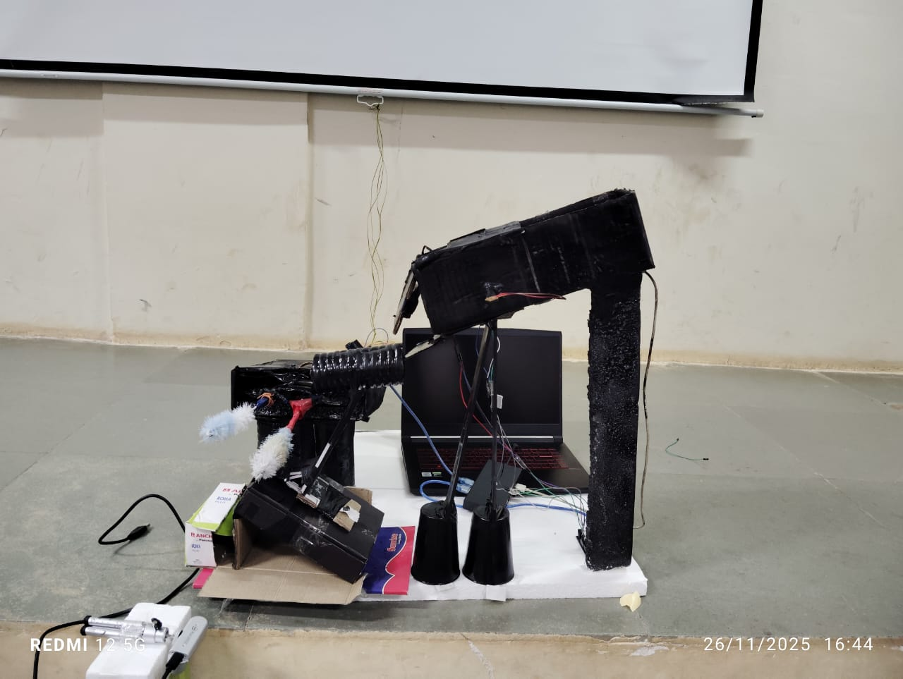
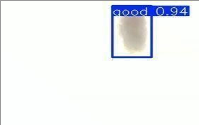
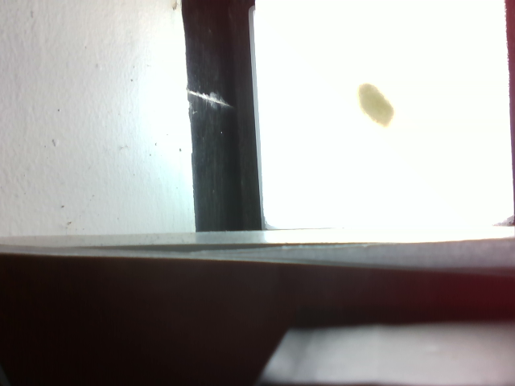
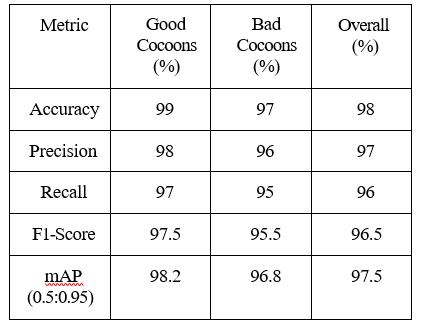

# AUTO-COCOON: Vision-Integrated System for Cocoon Processing and Quality Characterisation

AUTO-COCOON is an AI-powered computer vision system for automated silk cocoon quality assessment and sorting. The project combines image enhancement using a Convolutional Autoencoder (CAE), YOLOv8-based object detection, and a real-time inference pipeline to classify silk cocoons as **Good** or **Bad**. The proposed system aims to reduce manual inspection, improve classification consistency, and support scalable cocoon processing for sericulture applications.

---

# Project Overview

<table align="center">
<tr>
<td align="center"><b>System Architecture</b></td>
<td align="center"><b>Experimental Setup</b></td>
</tr>

<tr>
<td align="center">

</td>

<td align="center">

</td>
</tr>

<tr>
<td align="center"><b>CAE Augmentation</b></td>
<td align="center"><b>Detection Results</b></td>
</tr>

<tr>
<td align="center">

</td>

<td align="center">

</td>
</tr>

</table>

---

# Overview

Traditional cocoon quality assessment relies on manual inspection, making the process time-consuming and susceptible to inconsistencies. AUTO-COCOON addresses this challenge by integrating computer vision and deep learning techniques into an automated inspection workflow.

The proposed system employs a Convolutional Autoencoder (CAE) to generate high-quality augmented images that improve dataset diversity while preserving important cocoon characteristics. The enhanced dataset is then used to train a YOLOv8 object detection model capable of accurately identifying and classifying cocoon quality. The trained model is integrated into a real-time inference pipeline, enabling automated quality assessment and supporting future deployment in intelligent cocoon sorting systems.

---

# Key Features

- Automated cocoon quality assessment using computer vision
- CAE-based image augmentation for improved dataset diversity
- YOLOv8-based object detection and quality classification
- Real-time inference pipeline
- Modular system architecture
- Designed for future hardware-based automated sorting

---

# System Architecture

The complete system consists of a loader module, deflosser module, conveyor mechanism, image acquisition unit, AI-based cocoon classification, and a sorting mechanism for automated segregation of cocoons.

<p align="center">

</p>

---

# Model Development Pipeline

The AI model was developed using the workflow shown below.

<p align="center">

</p>

---

# Experimental Setup

The experimental prototype integrates hardware and software components required for automated cocoon inspection.

### Hardware Components

- Loader Module
- Deflosser Module
- Conveyor Module
- Camera Module
- LED Illumination Unit
- AI Processing Unit
- Sorting Mechanism

<p align="center">

</p>

---

# Dataset

The dataset consists of silk cocoon images captured under controlled lighting conditions. Images were manually annotated into **Good** and **Bad** quality categories for model training and evaluation.

<p align="center">

</p>

---

# Image Enhancement using Convolutional Autoencoder (CAE)

To improve dataset diversity while preserving the structural characteristics of silk cocoons, a Convolutional Autoencoder (CAE) was employed to generate augmented training samples.

<p align="center">

</p>

---

# YOLOv8 Detection Results

The augmented dataset was used to train a YOLOv8 object detection model capable of detecting and classifying cocoon quality in real time.

<p align="center">

</p>

---

# Performance Evaluation

The trained model demonstrated strong detection performance on the cocoon dataset.

<p align="center">

</p>

---

# Project Workflow

1. Capture cocoon images.
2. Annotate the dataset.
3. Perform image preprocessing.
4. Generate augmented images using the Convolutional Autoencoder.
5. Train the YOLOv8 model.
6. Evaluate detection performance.
7. Deploy the trained model.
8. Perform real-time inference.
9. Classify cocoon quality.
10. Enable automated sorting.

---

# Technologies Used

- Python
- OpenCV
- Ultralytics YOLOv8
- TensorFlow / Keras
- NumPy
- Intel RealSense Camera
- Google Colab

---

# Repository Structure

```text
AUTO-COCOON
│
├── images
│   ├── system_architecture.png
│   ├── model_development_pipeline.png
│   ├── setup.jpeg
│   ├── raw_captured_img.png
│   ├── cae_before_after.png
│   ├── yolo_detection_results.png
│   └── performance_metric.png
│
├── cae_augmentation
│   ├── cae_augmentation.py
│   └── README.md
│
├── yolo_training
│   ├── train.py
│   └── README.md
│
├── integration
│   ├── integration.py
│   └── README.md
│
├── requirements.txt
├── LICENSE
└── README.md
```

---

# Installation

```bash
git clone https://github.com/vibha92005/AUTO-COCOON-Vision-integrated-system-for-cocoon-processing-and-quality-characterisation.git

cd AUTO-COCOON-Vision-integrated-system-for-cocoon-processing-and-quality-characterisation

pip install -r requirements.txt
```

---

# Future Enhancements

- Edge deployment on Jetson Nano
- Raspberry Pi implementation
- Conveyor-based automated sorting
- Servo motor integration
- Multi-grade cocoon quality assessment
- Cloud-based monitoring and analytics

---
PAPER LINK : https://doi.org/10.1051/itmconf/20268701006
----
# Contributors

**Vibha I S**

**Ashitha M**

Department of Electronics and Communication Engineering

---

# License

This project is licensed under the MIT License.
